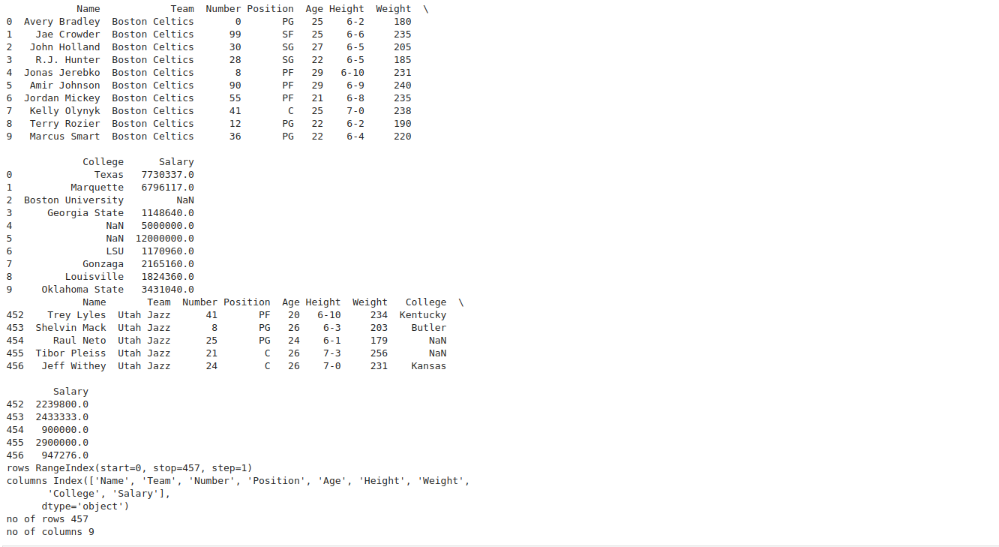

# Read-from-CSV

## AIM:


To write a python program to read contents from a CSV file

## ALGORITHM:

### Step 1:

Import pandas module as pd.

### Step 2:

Using pd.read_csv() method read the CSV file

### Step 3:

Using df.head() print the first 10 rows of the CSV file.

### Step 4:

Using df.tail() print the last 5 of the CSV file

### Step 5:

Using len(df.axes[]) print the toal no.of rows and columns with argument 0 for row and argument 1 for column.


## PROGRAM:
```
import pandas as pd
df=pd.read_csv("nba.csv")
print(df.head(10))
print(df.tail())
print("rows",df.axes[0])
print("columns",df.axes[1])
print("no of rows",len(df.axes[0]))
print("no of columns",len(df.axes[1]))

```

## OUTPUT:



## RESULT:

Thus the program executed successfully.